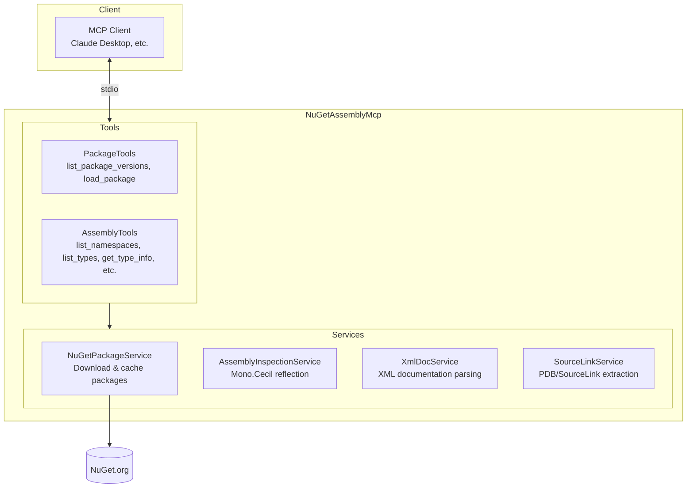

# NuGetAssemblyMcp

An MCP (Model Context Protocol) server that enables AI assistants to inspect and analyze .NET NuGet packages. Download packages, explore types and members, read XML documentation, and resolve source links—all through MCP tools.

## Features

- **Package Management** — Download and cache NuGet packages with automatic version resolution
- **Assembly Inspection** — Explore namespaces, types, and members using Mono.Cecil (safe IL-level reflection)
- **XML Documentation** — Extract summaries, parameter docs, and examples from XML doc files
- **SourceLink Integration** — Resolve repository URLs for browsing source code on GitHub, GitLab, or Azure DevOps
- **Smart Framework Selection** — Automatically selects the best target framework (net10.0 → netstandard → net48)
- **Regex Search** — Find types by pattern matching

## Installation

### Option 1: Download Pre-built Binary (Recommended)

Download the latest release for your platform from [GitHub Releases](https://github.com/your-repo/NuGetAssemblyMcp/releases):

| Platform | File |
|----------|------|
| Windows x64 | `NuGetAssemblyMcp-win-x64.exe` |
| Linux x64 | `NuGetAssemblyMcp-linux-x64` |
| macOS x64 (Intel) | `NuGetAssemblyMcp-osx-x64` |
| macOS ARM64 (Apple Silicon) | `NuGetAssemblyMcp-osx-arm64` |

These are self-contained single-file executables—no .NET runtime required.

**Linux/macOS:** Make the binary executable after downloading:
```bash
chmod +x NuGetAssemblyMcp-osx-arm64
```

### Option 2: Build from Source

Prerequisites: [.NET 10.0 SDK](https://dotnet.microsoft.com/download) or later

```bash
git clone https://github.com/your-repo/NuGetAssemblyMcp.git
cd NuGetAssemblyMcp
dotnet build -c Release
```

To create your own single-file executable:
```bash
dotnet publish src/NuGetAssemblyMcp/NuGetAssemblyMcp.csproj \
  -c Release \
  -r osx-arm64 \
  -p:PublishSingleFile=true \
  -p:SelfContained=true \
  -o ./publish
```

### Configure Your MCP Client

Add the server to your MCP client configuration. For example, in Claude Desktop's `claude_desktop_config.json`:

**Using a pre-built binary (recommended):**
```json
{
  "mcpServers": {
    "nuget-assembly": {
      "command": "/path/to/NuGetAssemblyMcp-osx-arm64"
    }
  }
}
```

**Using dotnet run (development):**
```json
{
  "mcpServers": {
    "nuget-assembly": {
      "command": "dotnet",
      "args": [
        "run",
        "--project",
        "/path/to/NuGetAssemblyMcp/src/NuGetAssemblyMcp/NuGetAssemblyMcp.csproj"
      ]
    }
  }
}
```

## MCP Tools

### Package Tools

#### `list_package_versions`
Lists all available versions of a NuGet package (newest first).

| Parameter | Type | Required | Description |
|-----------|------|----------|-------------|
| `packageId` | string | Yes | The NuGet package ID (e.g., "Newtonsoft.Json") |

#### `load_package`
Downloads and caches a NuGet package, returning metadata about the package contents.

| Parameter | Type | Required | Description |
|-----------|------|----------|-------------|
| `packageId` | string | Yes | The NuGet package ID |
| `version` | string | No | Specific version; defaults to latest stable |
| `targetFramework` | string | No | Target framework (e.g., "net8.0"); auto-selected if omitted |

**Returns:** Package metadata including repository URL, commit hash, and file availability.

### Assembly Tools

#### `list_namespaces`
Lists all public namespaces in a package's primary assembly.

| Parameter | Type | Required | Description |
|-----------|------|----------|-------------|
| `packageId` | string | Yes | The NuGet package ID |
| `version` | string | No | Package version |
| `targetFramework` | string | No | Target framework moniker |

#### `list_types`
Lists types (classes, interfaces, structs, enums, delegates) in a package assembly.

| Parameter | Type | Required | Description |
|-----------|------|----------|-------------|
| `packageId` | string | Yes | The NuGet package ID |
| `ns` | string | No | Namespace filter |
| `version` | string | No | Package version |
| `targetFramework` | string | No | Target framework moniker |

#### `get_type_info`
Returns comprehensive information about a specific type including members, XML documentation, and source link.

| Parameter | Type | Required | Description |
|-----------|------|----------|-------------|
| `packageId` | string | Yes | The NuGet package ID |
| `typeFullName` | string | Yes | Fully-qualified type name (e.g., "Newtonsoft.Json.JsonConvert") |
| `version` | string | No | Package version |
| `targetFramework` | string | No | Target framework moniker |

**Returns:** Markdown document with type metadata, constructors, properties, methods, events, fields, and documentation.

#### `get_member_info`
Returns detailed information about a specific member (method, property, field, event) including parameters and documentation.

| Parameter | Type | Required | Description |
|-----------|------|----------|-------------|
| `packageId` | string | Yes | The NuGet package ID |
| `typeFullName` | string | Yes | Fully-qualified type name |
| `memberName` | string | Yes | The member name (e.g., "SerializeObject") |
| `version` | string | No | Package version |
| `targetFramework` | string | No | Target framework moniker |

#### `search_types`
Searches for types by regex pattern.

| Parameter | Type | Required | Description |
|-----------|------|----------|-------------|
| `packageId` | string | Yes | The NuGet package ID |
| `pattern` | string | Yes | Regex pattern to match type names (e.g., ".*Converter$") |
| `version` | string | No | Package version |
| `targetFramework` | string | No | Target framework moniker |

## Usage Examples

### Explore a Package

```
"What namespaces are in Newtonsoft.Json?"
→ list_namespaces(packageId: "Newtonsoft.Json")

"Show me all types in the Newtonsoft.Json.Linq namespace"
→ list_types(packageId: "Newtonsoft.Json", ns: "Newtonsoft.Json.Linq")
```

### Inspect Types

```
"Tell me about the JsonConvert class"
→ get_type_info(packageId: "Newtonsoft.Json", typeFullName: "Newtonsoft.Json.JsonConvert")

"What does SerializeObject do?"
→ get_member_info(packageId: "Newtonsoft.Json", typeFullName: "Newtonsoft.Json.JsonConvert", memberName: "SerializeObject")
```

### Search

```
"Find all converter types in Newtonsoft.Json"
→ search_types(packageId: "Newtonsoft.Json", pattern: ".*Converter$")
```

### Version-Specific Queries

```
"What changed in version 12.0.0?"
→ load_package(packageId: "Newtonsoft.Json", version: "12.0.0")
→ list_types(packageId: "Newtonsoft.Json", version: "12.0.0")
```

## Architecture



## Cache

Packages are cached locally to avoid re-downloading:

```
~/.nuget-mcp/cache/
├── newtonsoft.json/
│   └── 13.0.3/
│       ├── lib/net8.0/
│       │   ├── Newtonsoft.Json.dll
│       │   ├── Newtonsoft.Json.xml
│       │   └── Newtonsoft.Json.pdb
│       └── Newtonsoft.Json.nuspec
```

The `.nupkg` file is deleted after extraction to save disk space.

## Dependencies

| Package | Purpose |
|---------|---------|
| [ModelContextProtocol](https://github.com/modelcontextprotocol/csharp-sdk) | MCP server framework |
| [Mono.Cecil](https://github.com/jbevain/cecil) | IL-level assembly inspection |
| [NuGet.Protocol](https://www.nuget.org/packages/NuGet.Protocol) | NuGet API client |
| [Microsoft.Extensions.Hosting](https://www.nuget.org/packages/Microsoft.Extensions.Hosting) | DI and hosting |

## Running Tests

```bash
dotnet test
```

Tests use [`Duende.IdentityServer`](https://www.nuget.org/packages/Duende.IdentityServer) as a real-world package fixture.

## License

MIT License — Copyright (c) 2025 Khalid Abuhakmeh
